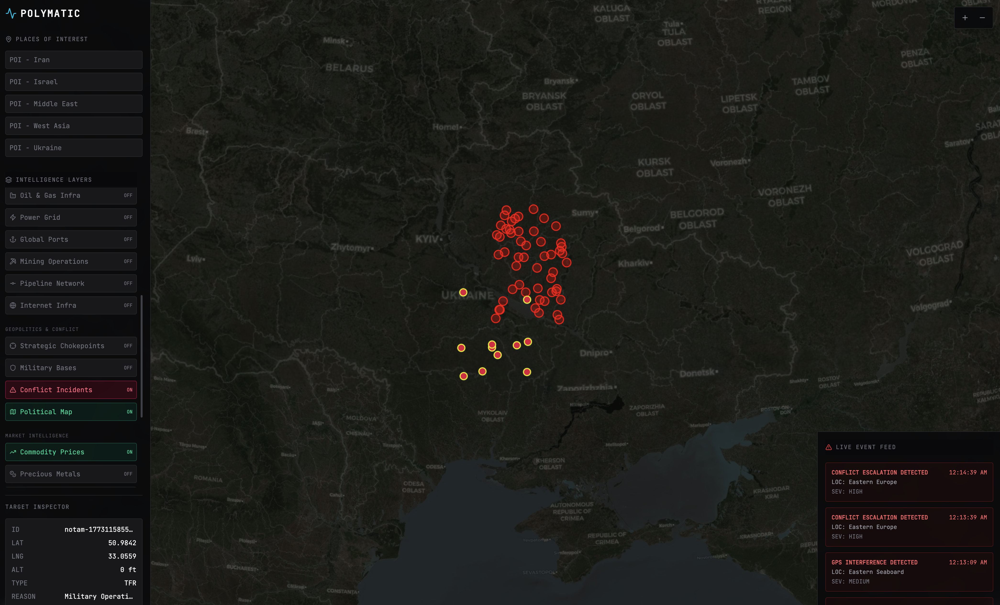

# PolyMatic — AI-native Macro Geospatial Intelligence

<p align="center">
  
  
</p>

## Architecture: Data Source Toggle (Mock vs Real API)

The frontend is capable of operating completely independently using a robust local Mock Data Engine, or switching to the real live backend API (referred to internally as the **RSDIP** — Realtime Semantic Data Ingestion Pipeline).

This switch is controlled dynamically via an environment variable and a local persist store, without requiring code changes to the UI components.

### 1. The Environment Variable
At build/startup time, Vite checks the `.env` file for the `VITE_DATA_SOURCE_MODE` variable:
```env
VITE_DATA_SOURCE_MODE=mock  # Can be "mock" or "rsdip"
```

### 2. The Flags Store (Runtime Override)
This environment variable serves as the initial state for the `flagsStore` (a Zustand store with local storage persistence). This allows developers to override the data source mode **at runtime** without restarting the dev server. For example, from the browser console:
```javascript
useFlagsStore.getState().setOverride('dataSourceMode', 'rsdip');
```

### 3. The Factory Pattern (`services/dataProvider.ts`)
The core switching mechanism happens inside `services/dataProvider.ts`, acting as a Factory:
* **`MockProvider`:** Returned if mode is `"mock"`. Uses powerful local mock generators to simulate real-time feed updates, market probability drifts, and sentiment classifications natively in the browser, complete with simulated network latency (200-500ms).
* **`RSDIPProvider`:** Returned if mode is `"rsdip"`. Makes actual HTTP and WebSocket remote calls to the FastAPI backend.

### 4. UI Layer Agnosticism
Because both providers conform to the exact same `DataProvider` TypeScript interface, the entire UI layer is completely blind to this switch. React components simply consume TanStack Query hooks (e.g., `useFeed()`, `useTrends()`) which ask the Factory for the current provider and call methods on it identically, making the transition seamless.

## Deployment of /polymatic-mvp/web

The MVP frontend is a Vite + React app. Build tooling lives in `polymatic-mvp/` (the parent directory), with `vite.config.ts` setting `root: 'web'` and outputting to `dist/`.

### Prerequisites

Install the Vercel CLI and log in:

```bash
npm i -g vercel
vercel login
```

### 1. Test the build locally

```bash
cd polymatic-mvp
npm install
npm run build
```

This should produce a `dist/` folder in `polymatic-mvp/`.

### 2. Deploy via CLI

From the `polymatic-mvp/` directory:

```bash
vercel
```

When prompted, configure:
- **Which scope?** — your Vercel account/team
- **Link to existing project?** — No (first time)
- **Project name** — `polymatic-mvp` (or your preference)
- **In which directory is your code located?** — `./`
- **Override build command?** — `npm run build`
- **Override output directory?** — `dist`

### 3. Set environment variables

The project uses `GEMINI_API_KEY`. Set it in the Vercel dashboard or via CLI:

```bash
vercel env add GEMINI_API_KEY
```

### 4. Production deploy

The first `vercel` command creates a preview deployment. For production:

```bash
vercel --prod
```

### Alternative: GitHub integration

If the repo is on GitHub, connect it via the [Vercel dashboard](https://vercel.com/new):

1. Import the repo
2. Set **Root Directory** to `polymatic-mvp`
3. Framework preset: **Vite**
4. Build command: `npm run build`
5. Output directory: `dist`
6. Add `GEMINI_API_KEY` in Environment Variables

This gives you automatic deploys on every push.

### Note on Cesium

The `vite.config.ts` uses `vite-plugin-cesium` which copies Cesium static assets into the build output. If the build fails on Vercel due to memory or timeout, check that Cesium's WASM assets are being output to `dist/` correctly, or increase the build memory limit in project settings.
